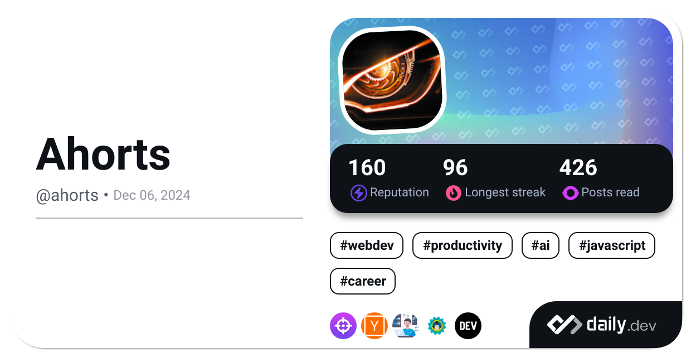

# Hello There 👋
- 🔭 I'm Godsway.
- 💬 Cyber security, systems and networking enthusiast.
- 🤔 Looking for like-minded developers.

## 💻 ~~Technologies I've used once~~ Experience

 ## 💪 Other Interests
    
 

## 📊 Activity

 
 
## ✍️ Quote

---

### 🤝 Get in Touch

   
  

